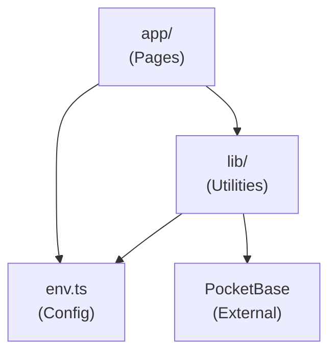

# Key Pair Responsibility: Sprint UI

## Project Overview & Business Context

**Sprint UI** is a modern web application built with Next.js and PocketBase. The project aims to provide a fast, type-safe, and easily deployable web application infrastructure.

### Business Goals
- Rapid development with modern tooling
- Type-safe codebase reducing runtime errors
- Easy deployment via Docker containers
- Scalable backend via PocketBase

---

## Key Modules & Responsibilities

### 1. App Router (`app/`)

**Responsibility:** Page routing, layouts, and server/client component orchestration.

| File | Purpose |
|------|---------|
| `layout.tsx` | Root layout wrapper, global providers |
| `page.tsx` | Home page component |

**Depends On:** `lib/`, `env.ts`

---

### 2. Library Layer (`lib/`)

**Responsibility:** Shared utilities and service clients.

| File | Purpose |
|------|---------|
| `pocketbase.ts` | Singleton PocketBase client instance |

**Depends On:** `env.ts`

**Key Export:**
```typescript
export default pb; // PocketBase instance
```

---

### 3. Environment Configuration (`env.ts`)

**Responsibility:** Type-safe environment variable validation and access.

| Variable | Scope | Purpose |
|----------|-------|---------|
| `NEXT_PUBLIC_POCKETBASE_URL` | Client | PocketBase API endpoint |
| `NODE_ENV` | Server | Runtime environment |

**Depends On:** `@t3-oss/env-nextjs`, `zod`

**Key Export:**
```typescript
export const env; // Validated environment object
```

---

### 4. Infrastructure (`Dockerfile`, `docker-compose.yml`)

**Responsibility:** Container definitions and orchestration.

| File | Purpose |
|------|---------|
| `Dockerfile` | Next.js app container build |
| `docker-compose.yml` | Multi-container setup (Next.js + PocketBase) |

**Services Defined:**
- `sprint-ui` - Next.js application (port 3000)
- `pocketbase` - PocketBase backend (port 8090)

---

## Module Dependency Graph



---

## Responsibility Matrix

| Concern | Owner Module | Notes |
|---------|--------------|-------|
| Routing | `app/` | Next.js App Router |
| State Management | TBD | To be implemented |
| API Communication | `lib/pocketbase.ts` | Via PocketBase SDK |
| Authentication | `lib/pocketbase.ts` | Via PocketBase Auth |
| Environment Config | `env.ts` | T3 Env pattern |
| Containerization | `Dockerfile` | Docker |
| Orchestration | `docker-compose.yml` | Docker Compose |
