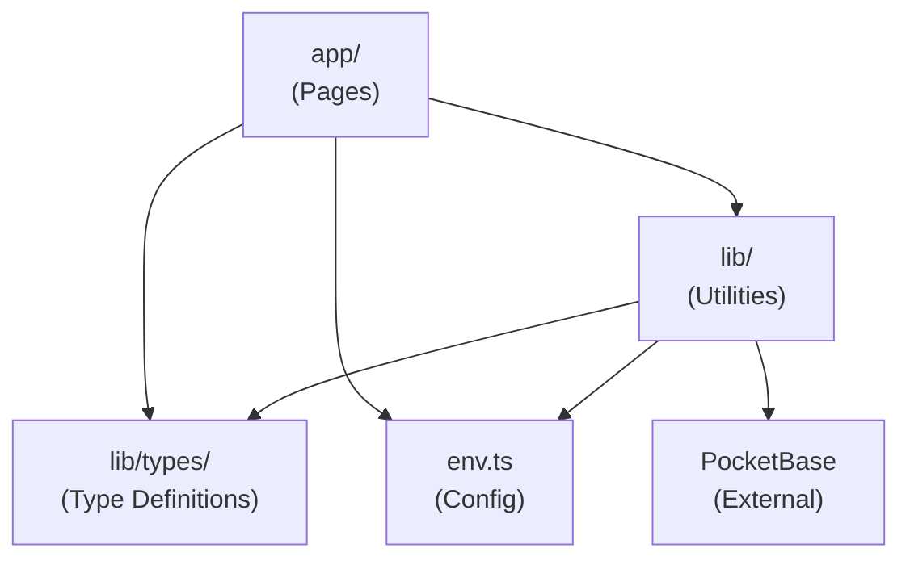

# Key Pair Responsibility: Sprint UI

## Project Overview & Business Context

**Sprint UI** is a biweekly design challenge platform where design teams practice UI skills through structured prompts, peer voting, and anonymous feedback. Built with Next.js 16 and PocketBase.

### Business Goals
- Facilitate designer skill development through structured challenges
- Enable peer feedback without attribution bias (anonymous during voting)
- Provide 100 pre-defined UI challenge prompts
- Support biweekly sprint cadence with submission deadlines
- Gamify progression with XP, skills, and badges

### Core Features
1. **Sprint Management** - Biweekly design challenges with prompts
2. **Design Submission** - Upload designs with multiple assets
3. **4-Category Voting** - Rate submissions on clarity, usability, visual craft, originality
4. **Anonymous Feedback** - Structured critique (works well, to improve, questions)
5. **Gamification** - XP system, 20 skills, 15 badges
6. **Retrospectives** - AI summaries, awards, learning resources

### Target Users
- Design teams participating in skill-building challenges
- Individual designers seeking structured practice
- Team leads managing design sprint programs

---

## Key Modules & Responsibilities

### 1. App Router (`app/`)

**Responsibility:** Page routing, layouts, and server/client component orchestration.

| File | Purpose |
|------|---------|
| `layout.tsx` | Root layout wrapper, global providers |
| `page.tsx` | Home page component |
| `ui/` | Subframe UI components |

**Depends On:** `lib/`, `env.ts`

---

### 2. Library Layer (`lib/`)

**Responsibility:** Shared utilities, service clients, and type definitions.

| File | Purpose |
|------|---------|
| `pocketbase.ts` | Singleton PocketBase client instance |
| `types/` | TypeScript interfaces for all collections |

**Depends On:** `env.ts`

**Key Export:**
```typescript
export default pb; // PocketBase instance
```

---

### 3. Types Module (`lib/types/`)

**Responsibility:** Type-safe interfaces for all 19 PocketBase collections.

| File | Purpose |
|------|---------|
| `pocketbase.ts` | Base interfaces for all collections |
| `expanded.ts` | Types with relation expansions |
| `index.ts` | Barrel export |

**Key Exports:**
```typescript
// Base types for all 19 collections
export type { User, Sprint, Submission, Vote, Feedback, ... };

// Expanded types for queries with relations
export type { SprintWithChallenge, SubmissionWithRelations, ... };

// Aggregation types for computed data
export type { VoteStats, LeaderboardEntry, UserXPSummary };

// Collection name constants
export { Collections };
```

**Type Categories:**
| Category | Count | Examples |
|----------|-------|----------|
| Base Types | 19 | User, Sprint, Submission, Vote |
| Union Types | 8 | SprintStatus, UserRole, AssetType |
| Expanded Types | 12 | SprintWithChallenge, VoteWithSubmission |
| Aggregation Types | 5 | VoteStats, LeaderboardEntry |

---

### 4. Environment Configuration (`env.ts`)

**Responsibility:** Type-safe environment variable validation and access.

| Variable | Scope | Purpose |
|----------|-------|---------|
| `NEXT_PUBLIC_POCKETBASE_URL` | Client | PocketBase API endpoint |
| `NODE_ENV` | Server | Runtime environment |

**Depends On:** `@t3-oss/env-nextjs`, `zod`

**Key Export:**
```typescript
export const env; // Validated environment object
```

---

### 5. Seed Data (`seed-data/`)

**Responsibility:** Static reference data for platform initialization.

| File | Records | Purpose |
|------|---------|---------|
| `challenges.json` | 100 | UI design challenge prompts |
| `skills.json` | 20 | Design skill categories |
| `badges.json` | 15 | Achievement badges |

**Data Characteristics:**
- Challenges: Numbered 1-100, categorized by UI pattern type
- Skills: Cover UX, visual design, accessibility, interaction design
- Badges: Achievement-based and milestone-based

---

### 6. Infrastructure (`Dockerfile`, `docker-compose.yml`)

**Responsibility:** Container definitions and orchestration.

| File | Purpose |
|------|---------|
| `Dockerfile` | Next.js app container build |
| `docker-compose.yml` | Multi-container setup (Next.js + PocketBase) |

**Services Defined:**
- `sprint-ui` - Next.js application (port 3000)
- `pocketbase` - PocketBase backend (port 8090)

---

## Module Dependency Graph



---

## Responsibility Matrix

| Concern | Owner Module | Notes |
|---------|--------------|-------|
| Routing | `app/` | Next.js App Router |
| UI Components | `app/ui/` | Subframe component library |
| State Management | TBD | To be implemented |
| API Communication | `lib/pocketbase.ts` | Via PocketBase SDK |
| Type Safety | `lib/types/` | Collection interfaces |
| Authentication | `lib/pocketbase.ts` | Via PocketBase Auth |
| Environment Config | `env.ts` | T3 Env pattern |
| Reference Data | `seed-data/` | Static JSON files |
| Containerization | `Dockerfile` | Docker |
| Orchestration | `docker-compose.yml` | Docker Compose |
| AI Context | `CLAUDE.md` | Claude Code guidance |
