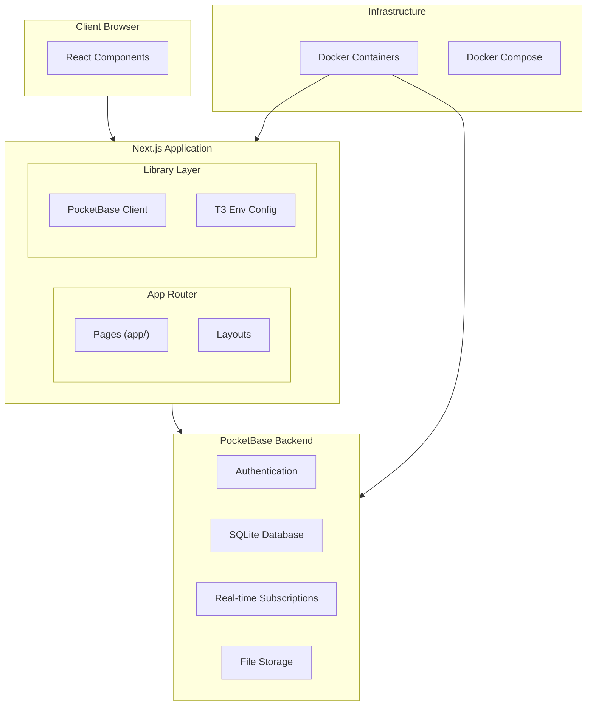
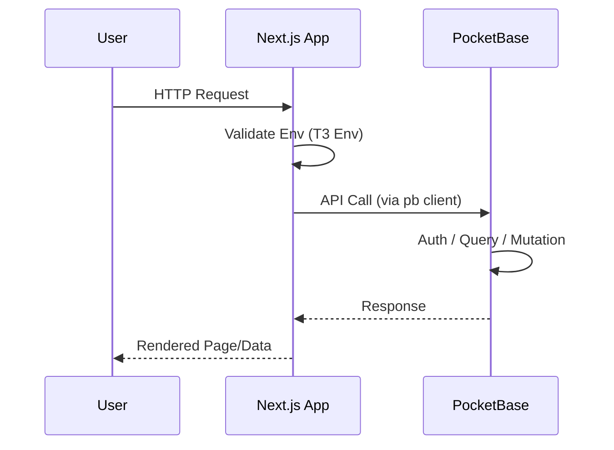
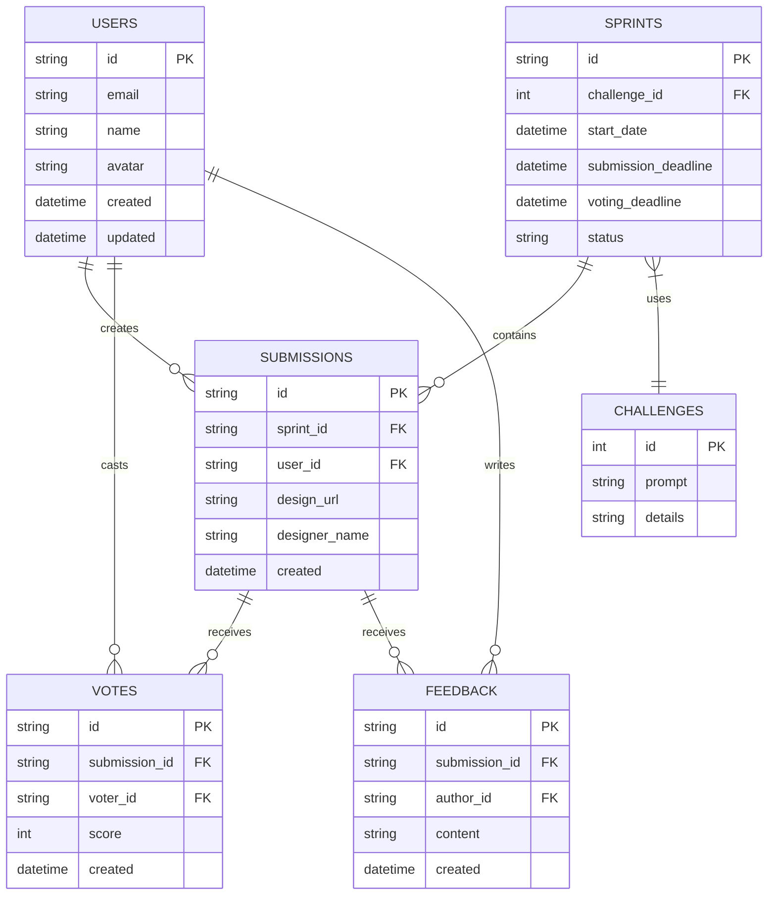
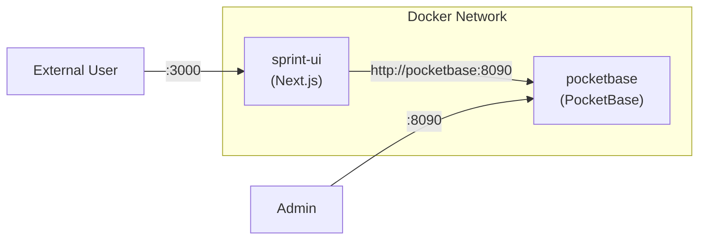

# System Architecture: Sprint UI

## High-Level System Architecture



## Request Flow



## Database Schema

*PocketBase collections for the design challenge platform:*



## File Architecture

```
sprint-ui/
├── app/                    # Next.js App Router
│   ├── layout.tsx          # Root layout
│   └── page.tsx            # Home page
├── lib/                    # Shared utilities
│   └── pocketbase.ts       # PocketBase singleton client
├── cline-docs/             # Architecture Documentation Hub
│   ├── systemArchitecture.md
│   ├── keyPairResponsibility.md
│   ├── glossary.md
│   └── techStack.md
├── memory-bank/            # Project Progress & Context
├── env.ts                  # T3 Env configuration
├── CLAUDE.md               # AI assistant guidance
├── Dockerfile              # Container definition
└── docker-compose.yml      # Multi-container setup
```

## Architecture Patterns

| Pattern | Implementation | Location |
|---------|---------------|----------|
| Singleton | PocketBase client instance | `lib/pocketbase.ts` |
| Validation | Environment variable schema | `env.ts` |
| Composition | App Router layouts | `app/layout.tsx` |

## Container Architecture


