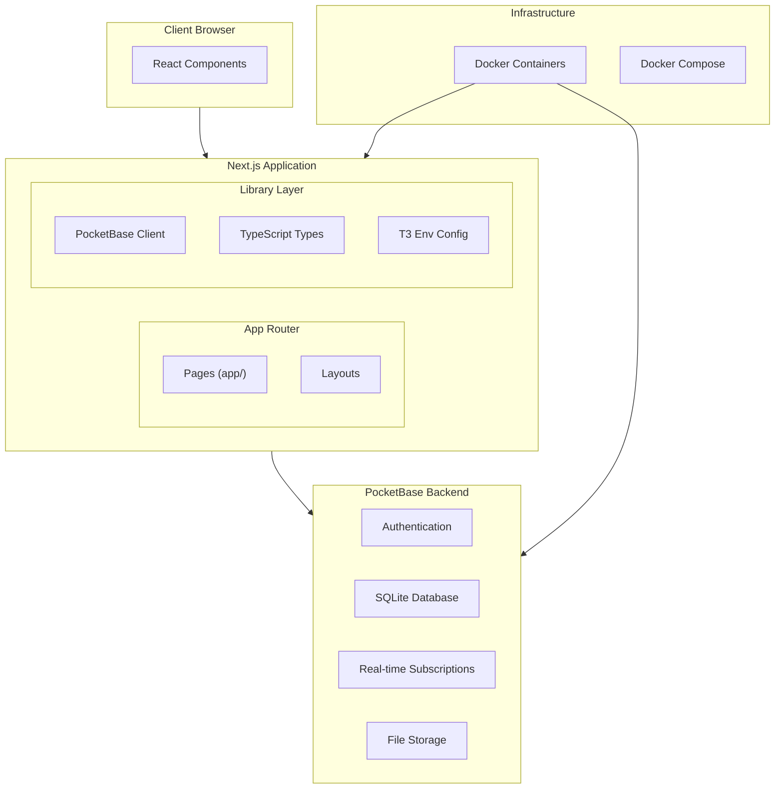
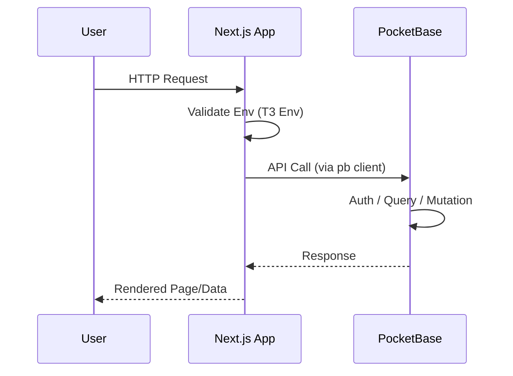
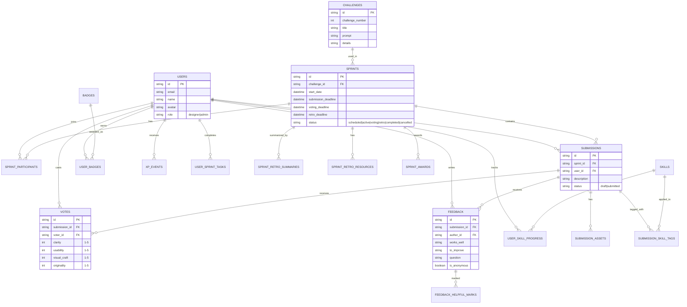
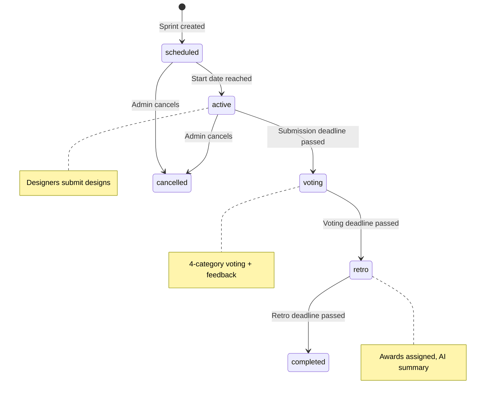
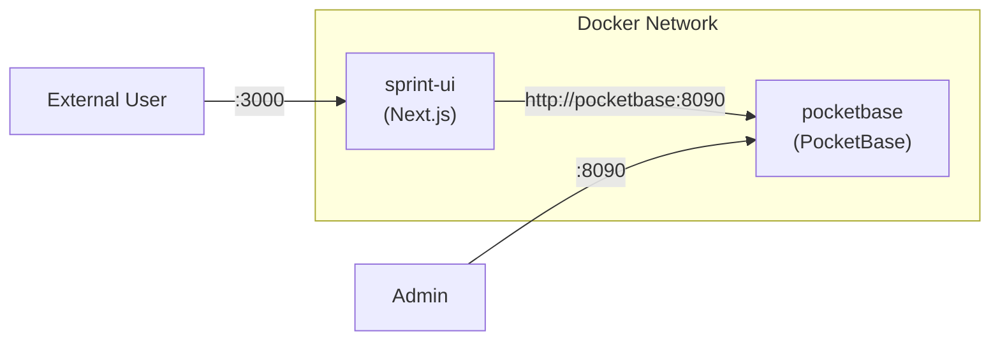

# System Architecture: Sprint UI

## High-Level System Architecture



## Request Flow



## Database Schema (19 Collections)

### Entity Relationships



### Collection Groups

| Group | Collections | Purpose |
|-------|-------------|---------|
| **Core** | users, challenges, sprints, sprint_participants | Platform foundation |
| **Submissions** | submissions, submission_assets, submission_skill_tags | Design entries |
| **Feedback** | votes, feedback, feedback_helpful_marks | Peer evaluation |
| **Gamification** | skills, user_skill_progress, badges, user_badges, xp_events, user_sprint_tasks | Engagement |
| **Retrospective** | sprint_retro_summaries, sprint_retro_resources, sprint_awards | Sprint wrap-up |

## Sprint Lifecycle



## File Architecture

```
sprint-ui/
├── app/                    # Next.js App Router
│   ├── ui/                 # Subframe UI components
│   ├── layout.tsx          # Root layout
│   └── page.tsx            # Home page
├── lib/                    # Shared utilities
│   ├── pocketbase.ts       # PocketBase singleton client
│   └── types/              # TypeScript type definitions
│       ├── pocketbase.ts   # Base collection interfaces
│       ├── expanded.ts     # Expanded types with relations
│       └── index.ts        # Barrel export
├── seed-data/              # JSON seed data files
│   ├── challenges.json     # 100 design challenges
│   ├── skills.json         # 20 design skills
│   └── badges.json         # 15 achievement badges
├── cline-docs/             # Architecture Documentation Hub
├── memory-bank/            # Project Progress & Context
├── env.ts                  # T3 Env configuration
├── pb_schema.json          # PocketBase schema export
├── CLAUDE.md               # AI assistant guidance
├── Dockerfile              # Container definition
└── docker-compose.yml      # Multi-container setup
```

## Architecture Patterns

| Pattern | Implementation | Location |
|---------|---------------|----------|
| Singleton | PocketBase client instance | `lib/pocketbase.ts` |
| Validation | Environment variable schema | `env.ts` |
| Composition | App Router layouts | `app/layout.tsx` |
| Type Safety | Collection interfaces | `lib/types/` |
| Barrel Export | Clean imports | `lib/types/index.ts` |

## Container Architecture


