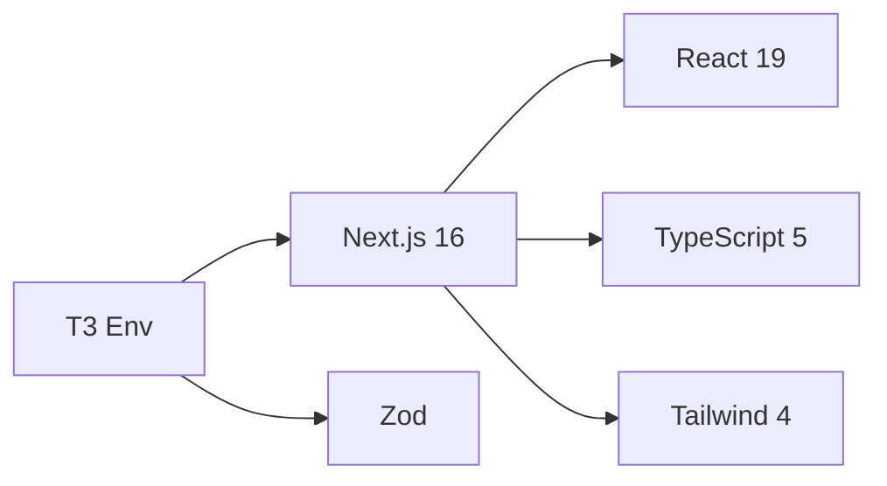

# Tech Stack: Sprint UI

## Core Technologies

### Frontend Framework

| Technology | Version | Purpose |
|------------|---------|---------|
| **Next.js** | 16.0.4 | React framework with App Router, SSR, and API routes |
| **React** | 19.2.0 | UI component library |
| **React DOM** | 19.2.0 | React rendering for web |

### Styling

| Technology | Version | Purpose |
|------------|---------|---------|
| **Tailwind CSS** | 4.x | Utility-first CSS framework |
| **@tailwindcss/postcss** | 4.x | PostCSS integration for Tailwind |

### Type Safety & Validation

| Technology | Version | Purpose |
|------------|---------|---------|
| **TypeScript** | 5.x | Static type checking |
| **@t3-oss/env-nextjs** | latest | Type-safe environment variables |
| **Zod** | latest | Runtime schema validation |

### Backend

| Technology | Version | Purpose |
|------------|---------|---------|
| **PocketBase** | 0.26.3 (SDK) | BaaS: database, auth, real-time, files |

### Development Tools

| Technology | Version | Purpose |
|------------|---------|---------|
| **ESLint** | 9.x | Code linting |
| **eslint-config-next** | 16.0.4 | Next.js-specific ESLint rules |

### Infrastructure

| Technology | Purpose |
|------------|---------|
| **Docker** | Application containerization |
| **Docker Compose** | Multi-container orchestration |

---

## Technology Decisions

### Why Next.js 16?
- Latest App Router features
- React Server Components support
- Built-in optimizations (image, font, script)
- Turbopack for fast builds

### Why PocketBase?
- Single binary deployment
- Built-in authentication
- Real-time subscriptions
- SQLite-based (simple, no external DB needed)
- Admin UI included

### Why T3 Env?
- Type-safe environment access
- Build-time validation catches missing vars
- Clear separation of server/client variables
- Better DX than raw `process.env`

### Why Tailwind CSS 4?
- Utility-first approach
- No CSS files to manage
- Excellent DX with IDE support
- Small production bundle (purges unused styles)

---

## Version Compatibility Matrix



---

## Package Categories

### Production Dependencies
```
next, react, react-dom, pocketbase, @t3-oss/env-nextjs, zod
```

### Development Dependencies
```
typescript, @types/node, @types/react, @types/react-dom,
eslint, eslint-config-next, tailwindcss, @tailwindcss/postcss
```

---

## Runtime Requirements

| Requirement | Specification |
|-------------|---------------|
| Node.js | 18.x or higher |
| npm | 9.x or higher |
| Docker | 20.x or higher (for containerized deployment) |
